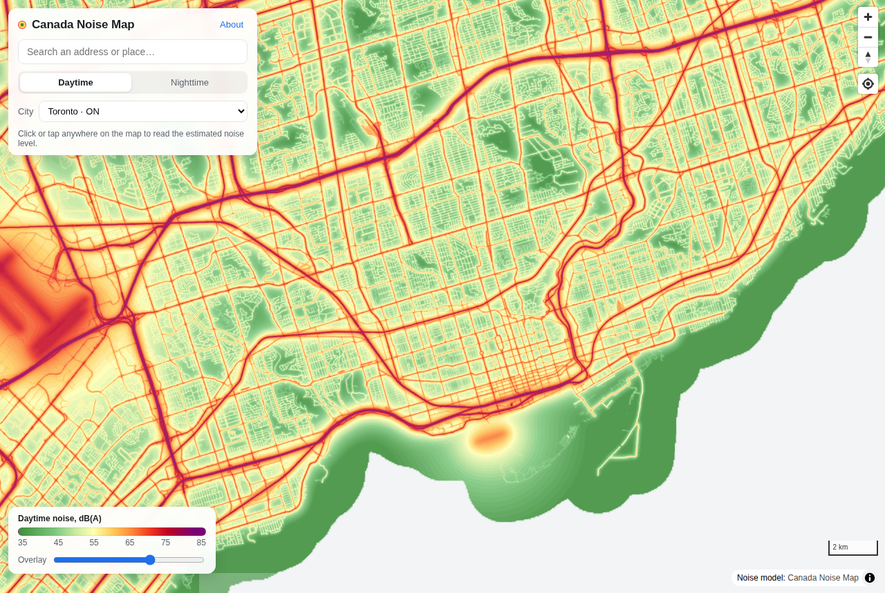

# Canada Noise Map

A free, open **noise-pollution map for Canadian cities** — the kind of "how loud is this address?" layer that US real-estate sites get from commercial data and the US DOT's [National Transportation Noise Map](https://www.bts.gov/geospatial/national-transportation-noise-map), which Canada does not have.

Everything is pre-computed

**Coverage (first release):** Toronto, Montréal, Vancouver, Ottawa–Gatineau, Calgary, Kitchener–Waterloo, Halifax, Victoria.



## What you can do on the map

* Click or tap anywhere to read the estimated daytime level (dB(A)), a plain-English category and a 50–100 "quiet score".
* Search an address or place (Photon geocoder), jump between cities, adjust overlay opacity, share a view with the URL hash.
* Read the *About* panel for the method, per-city statistics and a frank list of limitations.

## Run it locally

```bash
git clone https://github.com/Khayoon/canada-noise-map
cd canada-noise-map
python scripts/serve.py          # http://localhost:8000  (plain http.server won't do: PMTiles needs HTTP Range support)
```

The repository ships with the built tileset (`web/tiles/canada-noise.pmtiles`), so the site works immediately.

## Rebuild the tiles

```bash
python -m venv .venv && . .venv/bin/activate      # Windows: .venv\Scripts\activate
pip install -r requirements.txt
python -m pipeline.download                        # fetches the 8 city extracts from BBBike into data/
python -m pipeline.build                           # ~5 min on a laptop -> web/tiles/canada-noise.pmtiles + JSON sidecars
python -m pytest                                   # physics + encoding unit tests
python scripts/probe.py -79.3910 43.6385           # read a value from the built tiles (lon lat)
python tests/smoke_web.py                          # headless-Chromium test (needs: pip install playwright && playwright install chromium)
```

To add a city, append an entry to `pipeline/regions.json` and drop its `.osm.pbf` into `data/`. Any extract works — BBBike city extracts, Geofabrik provinces, or your own `osmium extract` bounding box. The computation is block-wise, so a whole province is only a matter of time, not memory.

## How the model works

The approach follows the BTS map in spirit but with a deliberately simple, transparent formulation (all knobs are in [`pipeline/config.py`](pipeline/config.py)):

1. **Sources.** Every OSM way tagged `highway=*` (motorway … service), `railway=*` (rail, light rail, tram, surface subway) and `aeroway=runway` is a line source. Tunnels are skipped.
2. **Emission.** Each road class has a reference level *L*<sub>ref</sub> at 15 m from the centreline (motorway 75 dB per carriageway, primary 69, residential 53, …), adjusted by `lanes` (+10·log₁₀ lanes/default) and `maxspeed` (+20·log₁₀ v/v<sub>ref</sub>), both clamped. Rail uses `usage`/`service` tags (main line 68, branch 60, yard 50). Runways are classed major / regional / minor from the airport's IATA code and runway length and get a level at 1 km (65 / 57 / 47 dB).
3. **Propagation.** Sources are burned into an energy raster on the Web-Mercator grid at zoom 13 (≈ 19 m Mercator, 12–14 m on the ground) and convolved with a kernel  
   *K(d) = (d² + h²)<sup>−p/2</sup> · 10<sup>−α·d/10</sup>*  
   whose line integral gives the classic line-source decay *d*<sup>1−p</sup>: with *p* = 2.5 that is 4.5 dB per doubling of distance (soft ground), plus α = 2 dB/km air/ground absorption. Runways use *p* = 2.2 and a 12 km kernel. The per-cell energy is calibrated analytically so an infinite straight road reproduces *L*<sub>ref</sub> at the reference distance (see `tests/test_model.py`).
4. **Summation.** All contributions are added in the energy domain and converted back to dB — two identical roads side by side give +3 dB, a 12-lane freeway mapped as four carriageways sums accordingly.
5. **Tiles.** The raster is sliced into 256-px PNG tiles at zooms 6–13 (lower zooms are energy-mean downsamples), coloured with a fixed palette, merged across cities and written to one PMTiles archive. The palette is bijective on the displayed range, so the web page decodes the PNG and inverts the colour to get the decibel value back — no separate data tiles needed.

Cells more than 1.5 km from any modelled source are transparent ("no estimate") rather than painted a misleading "very quiet".

### Sanity checks (Toronto)

| Location | Model | What you'd expect |
|---|---|---|
| Highway 401 at Yonge St (on the highway) | 76 dB | 75–80 dB on a 12-lane freeway |
| Gardiner Expressway at Spadina | 74 dB | 75–80 dB beside an elevated freeway |
| Yonge & Eglinton (sidewalk) | 74 dB | 70–75 dB at a major intersection |
| Leaside side street | 57 dB | 55–60 dB quiet residential |
| Rouge Park interior | 50 dB | 45–50 dB parkland |
| Pearson Airport, Terminal 1 | 66 dB | NEF 30–35 zone |

Median modelled daytime level across the Toronto extract is 59 dB; Toronto Public Health's 2017 measurement campaign reported daytime averages a little above 60 dB at its (road-biased) sites — the right ballpark for a model with no traffic counts.

## Limitations — read before quoting a number

* **It is a model, not a measurement.** Traffic volumes are inferred from road class, lane count and speed limit, not counted. Real levels on any given street can differ by 5 dB or more.
* **No buildings, terrain or barriers.** Shielding is ignored, so back yards, courtyards and streets behind highway berms are overestimated.
* **Airports are crude.** Runways are line sources; real flight tracks, runway usage, fleet mix and night curfews are not modelled.
* **Extract edges.** Sources just outside a city's bounding box are missing, so the last kilometre or so near an edge reads quieter than it is.
* **Daytime only.** One LAeq-style number; no Lden / Lnight split.
* Local sources (construction, bars, industry, sirens) are absent.

## Data, licences and credits

* Map data © [OpenStreetMap contributors](https://www.openstreetmap.org/copyright), licensed under the [ODbL](https://opendatacommons.org/licenses/odbl/). City extracts from [BBBike](https://download.bbbike.org/osm/bbbike/) (thanks!). The noise raster is a *derivative database* of OSM and is therefore also released under the ODbL.
* Basemap: [OpenFreeMap](https://openfreemap.org) (free, key-less, OSM-based). Geocoding: [Photon](https://photon.komoot.io) by komoot (fair use — swap in your own instance for heavy traffic).
* Front end: [MapLibre GL JS](https://maplibre.org) (BSD-3), [PMTiles](https://github.com/protomaps/PMTiles) (BSD-3), both vendored in `web/vendor/`.
* Method inspiration: the BTS National Transportation Noise Map (FHWA TNM / FAA AEDT based) and the WHO / EU END noise-mapping conventions (55 dB Lden as the first mapped band).
* Code: MIT (see `LICENSE`).

## Deploying

The site is the `web/` folder — plain static files, tileset included (~21 MB).

**GitHub Pages (zero config):** push to GitHub, enable *Settings → Pages → Source: GitHub Actions*. The workflow in `.github/workflows/pages.yml` publishes `web/` on every push to `main`. GitHub Pages serves HTTP range requests, which is all PMTiles needs.

**Vercel:** `vercel --prod` from the repo root; `vercel.json` sets the output directory to `web` and long-cache headers for the tiles. Netlify and Cloudflare Pages work the same way (Cloudflare Pages caps files at 25 MB, so host the `.pmtiles` on R2 or a GitHub release and point `tilesUrl` in `web/config.js` at it).

If the tileset ever outgrows GitHub's 100 MB file limit, upload it as a release asset or to Cloudflare R2 (free egress) and change `tilesUrl`.

## Project layout

```
pipeline/            OSM -> noise raster -> PMTiles
  config.py          every model parameter and the palette
  extract.py         pyosmium pass: ways -> line sources with emission levels
  model.py           grid, calibration, kernel, FFT convolution, dB raster
  tiles.py           pyramid, tile merging across cities, palette, MBTiles -> PMTiles
  build.py           the end-to-end CLI
  download.py        fetch city extracts from BBBike
  regions.json       which cities to build
web/                 the static site (deploy this folder)
  index.html / app.js / style.css / config.js
  tiles/canada-noise.pmtiles, regions.json, palette.json, meta.json   (generated)
  vendor/            MapLibre GL JS + pmtiles.js
scripts/serve.py     dev server with Range support
tests/               pytest unit tests + Playwright smoke test
```

## Ideas for a next version

* Real traffic counts where they exist (Ontario MTO AADT for provincial highways, City of Toronto and Montréal traffic-count open data) instead of class-based emissions.
* Validation against measured levels — Montréal publishes its acoustic measurements as open data; Toronto's 2017 study reports site averages — and an error figure in this README.
* Building footprints as barriers (OSM has them), or a full CNOSSOS-EU run with [NoiseModelling](https://noise-planet.org/noisemodelling.html).
* Lden / Lnight variants and per-address "noise score" API from the same tiles.
